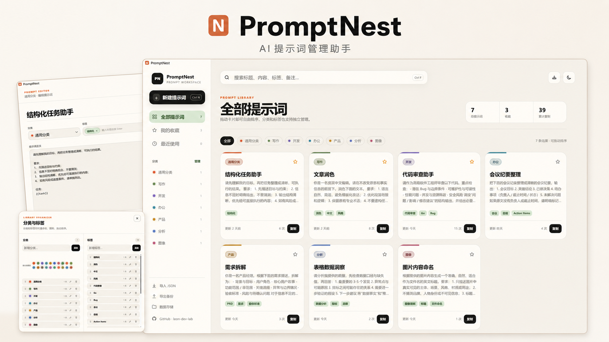
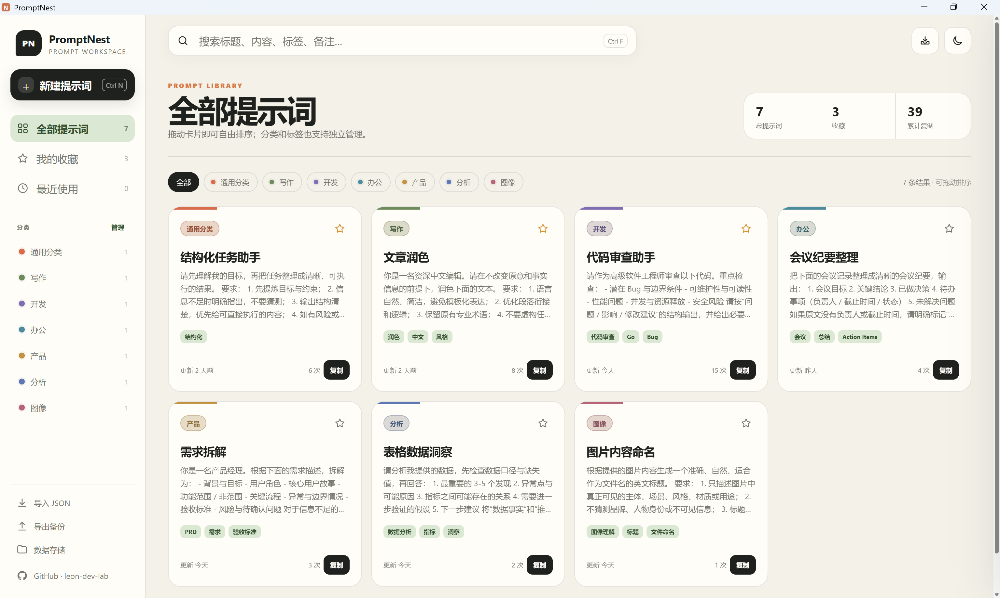
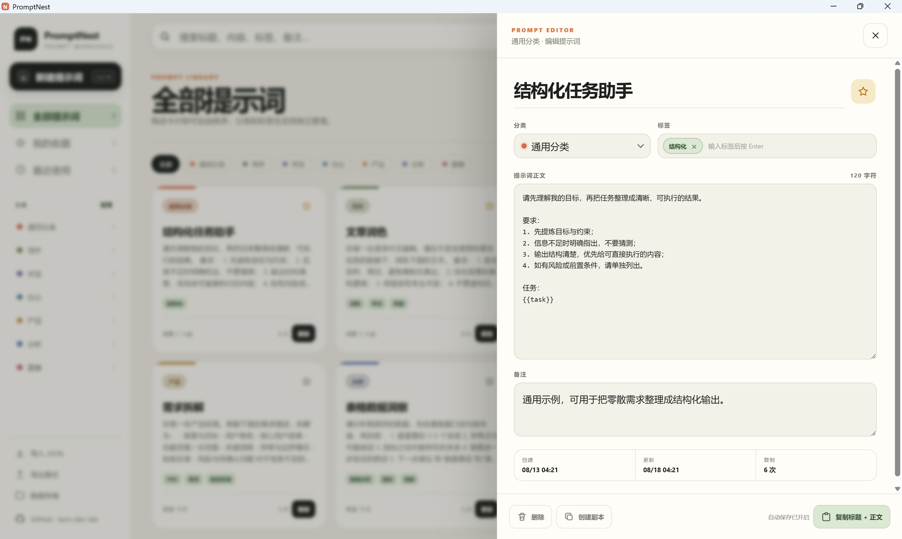
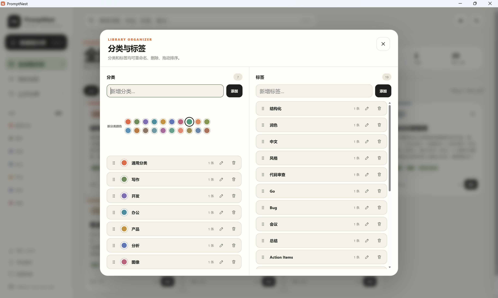

# PromptNest

> 一个轻量、精致、以本地数据为核心的 **AI 提示词助手（Prompt Library）**。  
> 用于收藏、整理、检索、分类和快速复用你常用的 AI 提示词。

**作者 / GitHub：** https://github.com/leon-dev-lab  
**项目仓库：** https://github.com/leon-dev-lab/PromptNest  
**许可证：** [MIT License](LICENSE)


## 界面预览

<p align="center">
  
  
</p>

<p align="center">
  
  
</p>


PromptNest 不是 AI 聊天客户端，也不绑定某个模型或平台。它更像一个专门为 Prompt 设计的本地知识库：把零散在记事本、聊天记录和各种文档里的提示词集中管理，需要时快速搜索、复制和复用。

界面采用自定义 **Warm Editorial Workspace** 视觉风格，不依赖大型 UI 组件库；提示词数据默认保存在本机，并支持自定义数据目录。

## ✨ 核心功能

- **提示词管理**：新建、编辑、删除、复制、收藏、创建副本
- **一键复制**：复制时自动组合“标题 + 提示词正文”
- **全文搜索**：支持标题、正文、分类、标签、备注快速检索
- **自由排序**：提示词卡片支持拖拽排序并持久化保存
- **分类管理**：新增、删除、重命名、拖拽排序
- **分类配色**：内置 20 种分类颜色，可自由选择
- **标签 Chips**：输入标签后按 `Enter` 创建，点击 `×` 即可移除
- **标签联想**：输入时根据当前有效标签库自动推荐历史标签
- **收藏与最近使用**：快速找到常用 Prompt
- **自动保存**：编辑内容约 650ms 防抖自动保存，无需频繁手动点击保存
- **JSON 导入 / 导出**：方便备份、迁移和恢复提示词库
- **自定义数据目录**：可以把数据放到你指定的文件夹中
- **浅色 / 深色模式**：支持主题切换
- **系统托盘**：支持关闭到托盘、双击托盘恢复窗口
- **GitHub 入口**：软件内可直接打开 `leon-dev-lab` GitHub 主页

## 🎯 适合谁使用

PromptNest 适合需要长期积累和复用提示词的人，例如：

- AI 写作与内容创作
- 软件开发 / Coding Prompt
- 产品需求、PRD、数据分析
- 图片生成与视觉提示词
- 办公自动化、总结、翻译、润色
- 经常在多个 AI 平台之间复用 Prompt 的用户

PromptNest 只负责管理 Prompt，不限制你把提示词用于 ChatGPT、Claude、Gemini、MiMo 或其他模型。

## 🧩 首次启动示例

首次运行且本地还没有 `prompts.json` 时，PromptNest 会自动创建一组演示数据，方便快速了解使用方式。

### 示例分类

- 通用分类
- 写作
- 开发
- 办公
- 产品
- 分析
- 图像

### 示例提示词

- 结构化任务助手
- 文章润色
- 代码审查助手
- 会议纪要整理
- 需求拆解
- 表格数据洞察
- 图片内容命名

这些内容仅作为首次启动示例，可以自由修改或全部删除。已有用户数据不会被默认示例覆盖。

## 🛠 技术栈

- **Go** — 本地业务逻辑与数据处理
- **Wails v2.14.0** — 桌面应用框架
- **Vue 3** — 前端界面
- **Vite** — 前端构建工具
- **WebView2** — Windows Web 渲染运行时
- **Custom CSS** — 自定义 Warm Editorial Workspace UI

## 📦 下载与运行

普通用户推荐直接从 GitHub 的 **Releases** 页面下载已经构建好的版本：

https://github.com/leon-dev-lab/PromptNest/releases

当前自动构建目标包括：

- Windows x64
- Windows ARM64
- macOS Universal（Intel + Apple Silicon）

> macOS 构建包如未进行 Apple Developer 签名 / 公证，首次运行时可能受到 Gatekeeper 提示。

## 💻 Windows 开发环境

本地开发建议准备：

```text
Go
Node.js + npm
WebView2 Runtime
```

项目不要求全局安装 Wails CLI，仓库中的构建脚本会使用固定的 Wails 版本。

## ▶️ 一键运行

Windows 下可以直接运行：

```bat
Run.bat
```

如果尚未构建，脚本会先完成构建，然后启动 PromptNest。

开发模式：

```bat
scripts\windows\Dev.bat
```

## 🔨 构建 Windows x64

```bat
Build_EXE.bat
```

构建完成后输出：

```text
build\bin\PromptNest.exe
```

## 📦 生成 GitHub Release ZIP

```bat
scripts\windows\Package_Release.bat
```

成功后会在 `release` 目录生成 Windows x64 发布包，例如：

```text
release\PromptNest-v2.6.0-win-x64.zip
```

该文件可以直接上传到 GitHub Releases。

## 🤖 GitHub Actions 自动构建

仓库包含 GitHub Actions 工作流，可自动构建：

```text
Windows x64
Windows ARM64
macOS Universal
```

推送类似下面的版本 Tag 后，可以触发正式版本构建：

```text
v2.6.0
v2.6.1
v2.7.0
```

构建产物可自动上传到 GitHub Releases。


## 🗂 项目结构

仓库根目录只保留入口、核心 Go 源码和常用项目文件；辅助脚本、截图与版本文档分别归档，避免首页文件列表过长。

```text
PromptNest/
├─ .github/
│  ├─ workflows/          # GitHub Actions 多平台构建
│  └─ CONTRIBUTING.md     # 贡献指南
├─ build/windows/         # Windows 图标等 Wails 构建资源
├─ docs/
│  ├─ images/             # README 界面截图
│  ├─ releases/           # 历史版本说明
│  └─ CHANGELOG.md
├─ frontend/              # Vue 3 + Vite 前端
├─ scripts/windows/       # Windows 开发、检查与发布辅助脚本
├─ app.go                 # Wails 应用桥接与业务入口
├─ datastore.go           # 本地数据存储
├─ models.go              # 数据模型
├─ tray_*.go              # 系统托盘实现
├─ main.go                # 程序入口
├─ Build_EXE.bat          # Windows x64 一键构建入口
├─ Run.bat                # Windows 一键运行入口
├─ go.mod
├─ wails.json
├─ README.md
└─ LICENSE
```

Windows 的高级辅助脚本说明见：[scripts/windows/README.md](scripts/windows/README.md)。
版本记录见：[docs/CHANGELOG.md](docs/CHANGELOG.md)。

## 💾 数据与隐私

Windows 默认数据文件位置：

```text
%LOCALAPPDATA%\PromptNest\prompts.json
```

应用内可以切换到任意自定义数据目录。

PromptNest 的提示词库默认保存在本地，不提供云同步，也不会因为升级程序而自动覆盖已有数据。

> 仓库本身不会包含你的个人 `prompts.json`、`settings.json`、API Key 或日志文件。

如果你设置过自定义数据目录，应用会继续读取该目录中的提示词数据。

## 🤝 贡献

欢迎提交 Issue、功能建议和 Pull Request。

详细说明请查看：[贡献指南](.github/CONTRIBUTING.md)

## 📄 开源许可

PromptNest 使用 [MIT License](LICENSE)。

你可以在遵守许可证的前提下自由使用、修改和分发本项目。

---

## ☕ 支持项目

如果 PromptNest 对你有帮助，欢迎给项目一个 ⭐ **Star**。

如果你愿意支持项目持续维护、功能优化和后续版本更新，也可以请作者喝杯咖啡 ☕  
你的支持会成为继续完善 PromptNest 的动力，感谢每一份鼓励。

<p align="center">
  
</p>

<p align="center">
  <sub>赞助完全自愿，不影响 PromptNest 的开源使用与功能。</sub>
</p>
